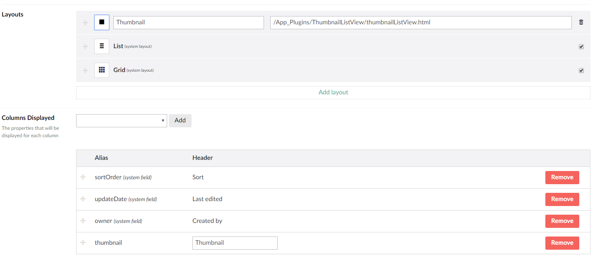

# Umbraco Thumbnail List View

An app_plugin for Umbraco that allows you to view a ListView with the following extras:

- A thumbnail image
- A title field from a linked document, e.g. article type

It works with all the original functionality of ListView, including selections, sort and search. 

### Compatibility

- Umbraco 8+
- Umbraco 7+ 
  
### Screenshot

### DataType

